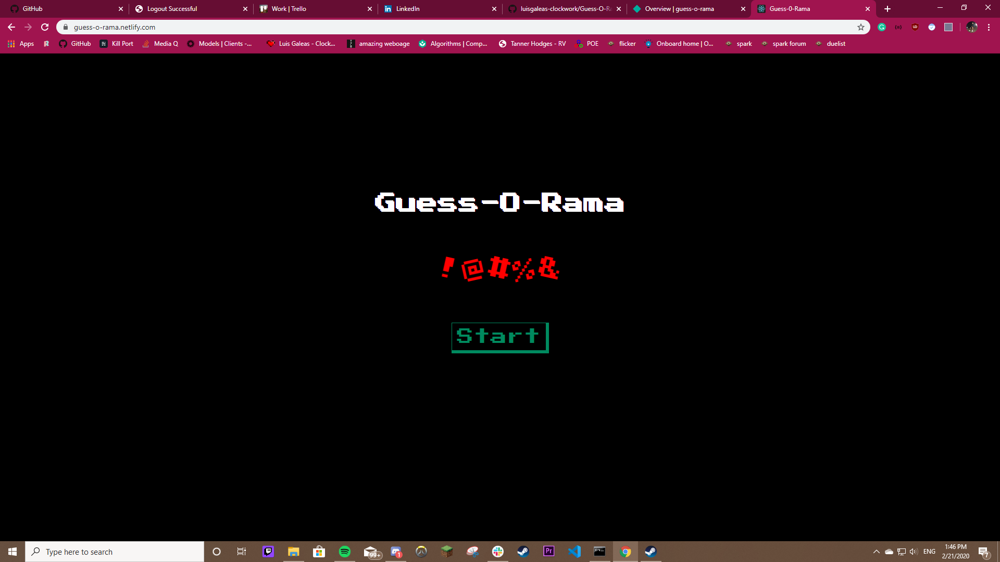
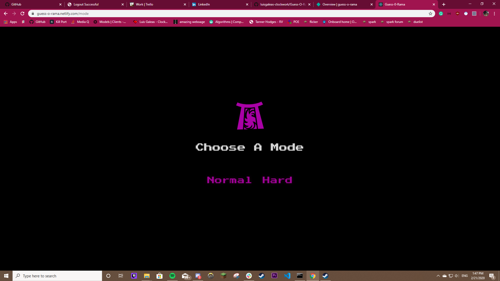
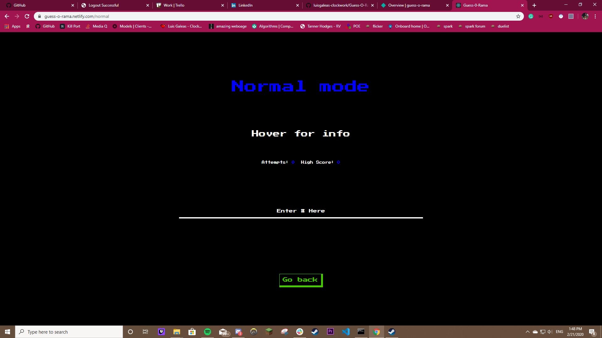
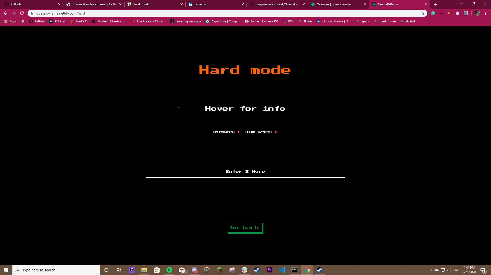
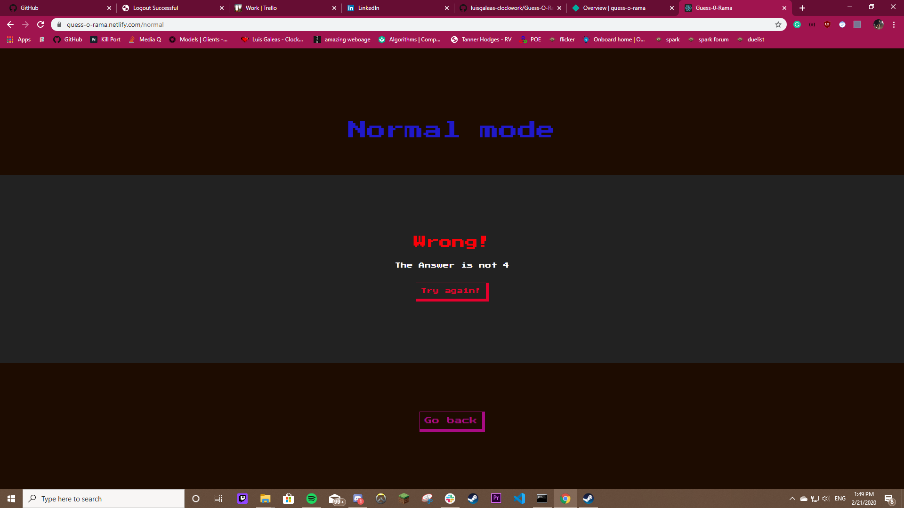

## Guess-O-Rama

Guessing Game using react.js

## Objective

The objective of this game is to guess the number depending on the mode you have chosen. There is a highscore 
that it counts for and still under development. Beating your highscore is an additional goal you can strive for
in the long run.

## Modes

## Normal

Guess the number between 0 and 10.

## Hard

Guess the number between 0 and 100


## Installation
 
 Run ``` npm install ``` in the root of the project to download dependencies.

 **If needed to audit run ``` npm audit fix ``` to fix any audit issues.**


## SnapShots
### Home Page

### Mode Page

### Normal Mode

### Hard Mode

### Wrong Modal

### Right Modal

